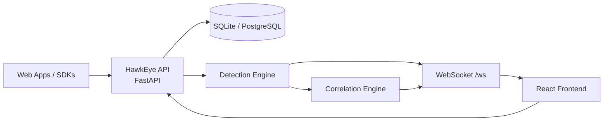

# HawkEye

> Web application security monitoring platform for ingesting security events, normalizing them with MITRE ATT&CK tags, running detection engines, correlating alerts into incidents, and surfacing everything through a REST + WebSocket backend and a React dashboard.
## Current State

HawkEye is actively being modernized.
- Backend MVP is complete and tested.
- WebSocket backend is complete, including reconnect support and header-based auth.
- Frontend dashboard work is in progress.
- Legacy Flask deployment remains available in `legacy-v1/` for reference only.
- The current README replaces the older legacy-oriented deployment notes and now tracks the new architecture.
## Architecture



## What HawkEye Does
- Ingests raw security events from applications.
- Normalizes events and enriches them with MITRE ATT&CK data.
- Runs 7 detection engines for brute force, credential stuffing, enumeration, bot activity, sensitive actions, session hijacking, and API abuse.
- Correlates alerts into incidents.
- Broadcasts alerts and incidents over WebSocket for real-time dashboards.
- Provides REST APIs for sources, events, alerts, incidents, ingestion, and API keys.

## Status Snapshot

| Area | Status | Notes |
| Backend API | Complete | FastAPI + SQLModel + auth + ingestion + alert/incident APIs |
| Detection/Correlation | Complete | 7 detectors + correlation engine |
| WebSocket backend | Complete | Multi-method auth, subscriptions, heartbeat, reconnect |
| Frontend foundation | In progress | React + TypeScript + Vite scaffold, dashboard shell, reusable UI |
| Alerts UI | In progress | Real-time alert feed and alerts page work underway |
| Legacy deployment | Archived | `legacy-v1/` is reference only |
| Production deployment | In progress | Docker/Kubernetes/Alembic work not yet finalized |

## Repository Layout

```text
Hawkeye/
├── hawkeye/                  # FastAPI backend package
│   ├── api/                  # REST + WebSocket endpoints
│   ├── core/                 # Auth and normalization helpers
│   ├── models/               # SQLModel tables and enums
│   ├── schemas/              # Request/response models
│   └── services/             # Ingestion, detection, correlation
├── frontend/                 # React + TypeScript + Vite dashboard
├── tests/                    # Backend and WebSocket tests
├── legacy-v1/                # Archived Flask deployment (reference only)
├── README.md                 # This document
├── CLAUDE.md                 # Developer handbook
├── SESSION.md                # Current active session state
├── TODO.md                   # Task backlog
├── ROADMAP.md                # Milestone progress
└── CHANGELOG.md              # Release history

## Backend

The backend is the source of truth for event processing.
### Core Features

- FastAPI application bootstrap with lifespan-managed database setup.
- Async SQLModel database layer with SQLite for development and PostgreSQL for production.
- API key auth with hashed keys and source isolation.
- Single and batch ingestion endpoints.
- Normalization engine with MITRE ATT&CK mapping.
- Detection engine orchestrating 7 detectors.
- Correlation engine that groups alerts into incidents.
- WebSocket manager for live alert and incident delivery.

### REST Endpoints

| Endpoint | Method | Purpose |
| `/api/v1/events/ingest` | POST | Ingest one event |
| `/api/v1/events/ingest/batch` | POST | Ingest a batch of events |
| `/api/v1/events/query` | GET | Query normalized events |
| `/api/v1/sources` | GET, POST | List or create sources |
| `/api/v1/alerts` | GET | List alerts |
| `/api/v1/alerts/stats` | GET | Alert statistics |
| `/api/v1/incidents` | GET | List incidents |
| `/api/v1/incidents/stats` | GET | Incident statistics |
| `/ws` | WS | Live alerts and incidents |

### WebSocket Auth

HawkEye accepts WebSocket auth in this order:
1. `Authorization: Bearer <api_key>`
2. `X-API-Key: <api_key>`
3. `?api_key=<api_key>` for backward compatibility

## Frontend

The frontend is being built as a real-time operations dashboard.
### Current Frontend Work

- React + TypeScript + Vite setup.
- Tailwind CSS and shadcn/ui-based component library.
- Dashboard shell with sidebar, top navigation, and theme toggle.
- API client typed to the backend schemas.
- Dashboard and Events pages are in place.
- Real-time alert feed work is underway and will consume the WebSocket backend.

### Planned Frontend Milestones

- Alerts page with WebSocket-driven feed.
- Incident timeline and drill-down views.
- Statistics charts.
- Source and API key management UI.
- Settings and theme persistence refinements.

## Getting Started

### Backend

```bash
pip install -e .
pytest tests/ -v
uvicorn hawkeye.main:app --reload
```

### Frontend

```bash
cd frontend
npm install
npm run dev
npm run build
npm run lint
```

## Verification

Current verified baseline:

- Backend tests: 33/33 passing.
- Frontend build: passing.
- WebSocket backend: authenticated, reconnectable, and covered by tests.

## Deployment Notes

Production deployment is still being built out.

- `legacy-v1/` contains the archived Flask deployment.
- The new deployment path is centered on FastAPI + React.
- Docker, Kubernetes, and migration tooling will be added later in the roadmap.

## Development Workflow

1. Read `CLAUDE.md` and `SESSION.md`.
2. Work one task at a time from `TODO.md`.
3. Verify with tests and build checks.
4. Update docs and changelog when work lands.
5. Commit changes in small, logical groups.

## Notes

- `legacy-v1/` is archived and should not be used as the active code path.
- The repository is mid-transition to the new deployment stack.
- If you are looking for the next active task, check `SESSION.md`.
# HawkEye v2 — Web Application Security Monitoring Platform

> **Production-ready SIEM-lite** for application-layer security monitoring. Ingests events from web applications, normalizes with MITRE ATT&CK tags, runs 7 detection engines, correlates alerts into incidents, and exposes real-time dashboard via WebSocket + React.

---

## 🏗️ Architecture

```
┌─────────────┐     ┌──────────────────┐     ┌──────────────┐
│  Web Apps   │────▶│  HawkEye API     │────▶│  PostgreSQL  │
│  (SDKs)     │     │  (FastAPI)       │     │  (SQLModel)  │
└─────────────┘     └────────┬─────────┘     └──────────────┘
                             │
              ┌──────────────┼──────────────┐
              ▼              ▼              ▼
       ┌────────────┐ ┌─────────────┐ ┌────────────┐
       │ Ingestion  │ │ Detection   │ │ Correlation│
       │ Service    │ │ Engine (7x) │ │ Engine     │
       └────────────┘ └─────────────┘ └────────────┘
              │              │              │
              ▼              ▼              ▼
       ┌──────────────────────────────────────────┐
       │            REST + WebSocket API          │
       └──────────────────────────────────────────┘
              │              │              │
              ▼              ▼              ▼
       ┌────────────┐ ┌─────────────┐ ┌────────────┐
       │  Frontend  │ │  Browser    │ │   SDKs     │
       │  (React)   │ │  Agent      │ │ (Python/JS)│
       └────────────┘ └─────────────┘ └────────────┘
```

---

## ✅ Current Status (2026-07-26)

| Milestone | Status | Progress |
|-----------|--------|----------|
| **1: Backend MVP** | ✅ Complete | 100% |
| **2: WebSocket Backend** | ✅ Complete | 100% |
| **3: Frontend Dashboard** | 🟢 In Progress | ~40% |
| 4: Browser Security Agent | ⏳ Planned | 0% |
| 5: SDK Integrations | ⏳ Planned | 0% |
| 6: Attack Replay & Docs | ⏳ Planned | 0% |

**Backend (Milestones 1-2):** Fully functional — 33/33 tests passing, WebSocket with reconnection protocol, 7 detection engines, correlation engine, REST APIs, API key auth.

**Frontend (Milestone 3):** React + TypeScript + Vite scaffold complete with Tailwind + shadcn/ui, Dashboard page, Events page, API client, routing, theming. Next: WebSocket integration (real-time alert feed).

---

## 🚀 Quick Start

### Backend
```bash
# Install dependencies
pip install -e ".[dev]"

# Run dev server (SQLite by default)
uvicorn hawkeye.main:app --reload

# API available at http://localhost:8000
# OpenAPI docs at http://localhost:8000/docs
```

### Frontend
```bash
cd frontend
npm install
npm run dev

# Dev server at http://localhost:5173
```

### Run Tests
```bash
# Backend tests
pytest tests/ -v

# Frontend lint/typecheck
cd frontend && npm run lint && npm run build
```

---

## 🔧 Configuration

All settings via environment variables (see `hawkeye/config.py`):

| Variable | Default | Description |
|----------|---------|-------------|
| `DATABASE_URL` | `sqlite+aiosqlite:///hawkeye.db` | Async SQLAlchemy URL |
| `API_KEY_LENGTH` | `32` | Generated API key length (bytes) |
| `BCRYPT_ROUNDS` | `12` | Password hashing cost |
| `DETECTION_TIME_WINDOW_MINUTES` | `60` | Detection engine lookback window |
| `CORRELATION_TIME_WINDOW_HOURS` | `24` | Correlation engine grouping window |
| `FRONTEND_WS_HEARTBEAT_SECONDS` | `30` | WebSocket ping interval |
| `SESSION_TTL_SECONDS` | `3600` | WebSocket session TTL for reconnection |

---

## 📡 API Reference

### Authentication
All endpoints require `X-API-Key` header (except `/health`, `/`).

### REST Endpoints (`/api/v1`)

| Endpoint | Methods | Description |
|----------|---------|-------------|
| `/events/ingest` | POST | Ingest single event |
| `/events/ingest/batch` | POST | Ingest batch of events |
| `/events/query` | GET | Query normalized events |
| `/events/{id}` | GET | Get event by ID |
| `/sources` | GET, POST | List/create sources |
| `/sources/{id}` | GET, PATCH, DELETE | Source CRUD |
| `/sources/{id}/api-keys` | GET, POST | List/create API keys |
| `/sources/{id}/api-keys/{key_id}` | DELETE | Revoke API key |
| `/alerts` | GET | List alerts (filterable) |
| `/alerts/stats` | GET | Alert statistics |
| `/alerts/{id}` | GET | Get alert details |
| `/alerts/{id}/status` | PATCH | Update alert status |
| `/incidents` | GET | List incidents (filterable) |
| `/incidents/stats` | GET | Incident statistics |
| `/incidents/{id}` | GET | Get incident details |
| `/incidents/{id}/alerts` | GET | Get incident's alerts |
| `/incidents/{id}/status` | PATCH | Update incident status |

### WebSocket (`/ws`)

**Connection:**
```bash
# Via header (recommended)
wscat -c ws://localhost:8000/ws -H "Authorization: Bearer <api_key>"

# Or query param (legacy)
wscat -c "ws://localhost:8000/ws?api_key=<api_key>"
```

**Subscribe to events:**
```json
{"type": "subscribe", "data": {"types": ["alerts", "incidents"]}}
```

**Server messages:**
```json
{"type": "connected", "data": {"connection_id": "...", "source_id": 1, "subscriptions": ["alerts"], "session_id": "..."}}
{"type": "alert", "event_id": 1, "timestamp": "...", "data": {...}}
{"type": "incident", "event_id": 2, "timestamp": "...", "data": {...}}
{"type": "ping", "timestamp": "..."}
```

**Reconnection:**
```json
{"type": "reconnect", "data": {"session_id": "...", "last_event_id": 123}}
```

**Stats endpoint:** `GET /ws/stats`

---

## 🛡️ Detection Engines (7 Total)

| Detector | MITRE Tactics | Description |
|----------|---------------|-------------|
| **BruteForce** | T1110.001 | Failed login threshold per IP/user |
| **CredentialStuffing** | T1110.004 | Many unique users from single IP |
| **Enumeration** | T1590, T1592 | Path/parameter scanning patterns |
| **Bot** | T1586.001 | Headless browser, automation signatures |
| **SensitiveAction** | T1078, T1556 | Admin actions, password changes, MFA disable |
| **SessionHijacking** | T1556.002 | Impossible travel, concurrent sessions |
| **APIAbuse** | T1505, T1583 | Rate anomalies, parameter tampering |

---

## 🔗 Integration

### Create a Source & API Key
```bash
# Create source
curl -X POST http://localhost:8000/api/v1/sources \
  -H "Content-Type: application/json" \
  -d '{"name": "my-app", "description": "Production API"}'

# Create API key (returns plaintext key once)
curl -X POST http://localhost:8000/api/v1/sources/1/api-keys \
  -H "Content-Type: application/json" \
  -d '{"name": "prod-key"}'
```

### Ingest Events
```bash
curl -X POST http://localhost:8000/api/v1/events/ingest \
  -H "X-API-Key: <your_key>" \
  -H "Content-Type: application/json" \
  -d '{
    "timestamp": "2026-07-26T10:30:00Z",
    "category": "authentication",
    "event_type": "login_failed",
    "severity": "medium",
    "user_id": "user123",
    "ip": "192.168.1.100",
    "route": "/api/login",
    "method": "POST",
    "status": 401,
    "user_agent": "Mozilla/5.0...",
    "metadata": {"reason": "invalid_password"}
  }'
```

### Frontend WebSocket Connection
```typescript
// See frontend/src/hooks/useWebSocket.ts (to be implemented)
const ws = new WebSocket("ws://localhost:8000/ws", {
  headers: { "Authorization": `Bearer ${apiKey}` }
});

ws.onmessage = (event) => {
  const msg = JSON.parse(event.data);
  if (msg.type === "alert") {
    // Handle real-time alert
  }
};
```

---

## 🧪 Testing

```bash
# All tests
pytest tests/ -v

# Specific modules
pytest tests/test_detection.py -v
pytest tests/test_ingestion.py -v
pytest tests/test_websocket.py -v

# With coverage
pytest tests/ --cov=hawkeye --cov-report=term-missing
```

**Test Structure:**
- `test_detection.py` — DetectionEngine, 7 detectors, DetectionContext (18 tests)
- `test_ingestion.py` — IngestionService, NormalizationEngine, schemas (6 tests)
- `test_websocket.py` — ConnectionManager, WebSocket endpoint, auth, reconnection, stats (11 tests)

---

## 📁 Project Structure

```
Hawkeye/
├── hawkeye/                    # Backend (FastAPI)
│   ├── main.py                 # App entry, lifespan, CORS, health
│   ├── config.py               # Pydantic Settings
│   ├── database.py             # Async SQLModel engine/session
│   ├── core/
│   │   ├── auth.py             # API key hashing, verification
│   │   └── normalization.py    # Event normalization + MITRE mapping
│   ├── models/
│   │   ├── events.py           # SQLModel tables
│   │   └── enums.py            # Severity, DetectionType, AlertStatus, IncidentStatus
│   ├── schemas/                # Pydantic request/response models
│   ├── api/
│   │   ├── deps.py             # FastAPI dependencies (auth, session)
│   │   └── v1/                 # REST endpoints (ingestion, events, sources, alerts, incidents)
│   ├── api/websocket.py        # WebSocket endpoint + ConnectionManager
│   └── services/
│       ├── ingestion_service.py
│       ├── detection/
│       │   ├── engine.py       # DetectionEngine (orchestrates 7 detectors)
│       │   ├── base.py         # BaseDetector, DetectionContext, Alert factory
│       │   ├── brute_force.py
│       │   ├── credential_stuffing.py
│       │   ├── enumeration.py
│       │   ├── bot.py
│       │   ├── sensitive_actions.py
│       │   ├── session_hijacking.py
│       │   └── api_abuse.py
│       └── correlation/
│           └── engine.py       # CorrelationEngine (time-window grouping)
├── frontend/                   # Frontend (React + TS + Vite)
│   ├── src/
│   │   ├── api/client.ts       # API client + TanStack Query keys
│   │   ├── components/
│   │   │   ├── ui/             # shadcn/ui primitives (14 components)
│   │   │   ├── layout/         # AppLayout, Sidebar, TopNav
│   │   │   └── providers/      # ThemeProvider
│   │   ├── pages/
│   │   │   ├── Dashboard.tsx   # Stats cards + quick actions
│   │   │   └── Events.tsx      # Filterable event table
│   │   ├── hooks/              # useToast, useWebSocket (planned)
│   │   ├── lib/utils.ts        # cn() helper
│   │   ├── types/index.ts      # TypeScript types matching backend
│   │   ├── App.tsx             # Router + route definitions
│   │   └── main.tsx            # Entry + providers
│   └── package.json
├── tests/                      # Pytest suite (33 tests)
├── legacy-v1/                  # Archived Flask v1 (reference only)
├── pyproject.toml              # Build config, deps, tool settings
├── CLAUDE.md                   # Developer handbook (this project)
├── SESSION.md                  # Current session state
├── TODO.md                     # Engineering backlog
├── ROADMAP.md                  # 6-milestone roadmap
└── CHANGELOG.md                # Release history
```

---

## 📋 Development Workflow

1. **Read** `CLAUDE.md` (this file) + `SESSION.md` (current task)
2. **Implement** single active task from `TODO.md`
3. **Verify** with tests (`pytest tests/ -v`) and lint (`ruff check hawkeye/`)
4. **Update docs** in order: `SESSION.md` → `TODO.md` → `CHANGELOG.md` → `ROADMAP.md`
5. **Commit** with descriptive message

---

## 🛣️ Roadmap Summary

| Milestone | Focus | Key Deliverables |
|-----------|-------|------------------|
| **1** ✅ | Backend MVP | 7 detectors, correlation, REST APIs, auth, DB, tests |
| **2** ✅ | WebSocket Backend | `/ws` endpoint, ConnectionManager, broadcast, reconnection |
| **3** 🟢 | Frontend Dashboard | React+TS+Vite, real-time alert feed, incident timeline, charts, source mgmt |
| **4** ⏳ | Browser Agent | Chrome MV3 extension, CSP/DOM monitoring, bot detection |
| **5** ⏳ | SDKs | Flask/FastAPI/Express middleware, Python/JS clients |
| **6** ⏳ | Attack Replay | Replay engine, UI, Docker/K8s deploy, full docs |

---

## 🤝 Contributing

1. Read `CLAUDE.md` and `SESSION.md`
2. Pick next task from `TODO.md` (respecting dependencies)
3. Implement, test, lint
4. Update documentation per workflow above
5. Submit PR

---

## 📄 License

MIT License — see LICENSE file for details.

---

## 🔗 Links

- **API Docs (dev):** http://localhost:8000/docs
- **Frontend (dev):** http://localhost:5173
- **Archived v1:** `legacy-v1/` (Flask, not maintained)